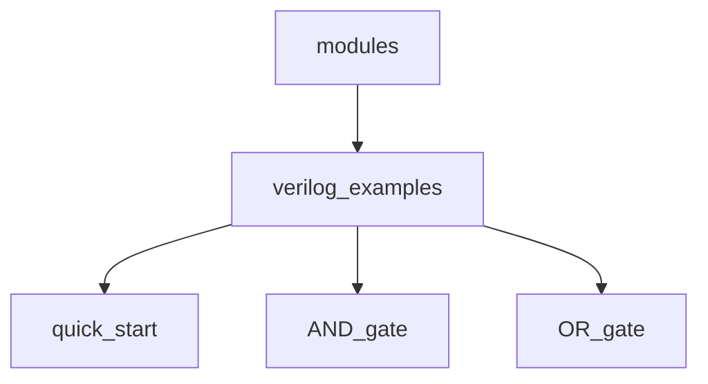
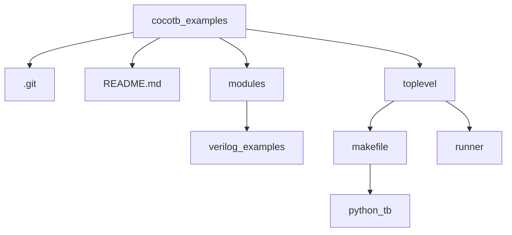

## Cocotb examples using Verilog/VHDL description language

### 0. Requirments:  
- Operating system: Linux / Windows / macOS
- A Verilog or VHDL simulator
- python = 3.13.2
- pip = 24.2
- cocotb = 2.0.0.dev0+63054b88

### 1. Installation of the cocotb
* Install dependencies
` sudo yum install make python3 python3-pip python3-libs `

* Install cocotb
` pip install cocotb `

*  Check the installation
`cocotb-config --version`

### 2. TEST BENCH
### A. Using Makefile:
* Compilation using makefile
    * define/change/write
        - Makefile
        - Test bench file (python)
    ```mermaid
    graph TD;
        makefile-->python_tb;
        python_tb-->quick_start_tb;
        python_tb-->AND_gate_tb;
        python_tb-->OR_gate_tb;
    ```
    * command
        `make`

### B. Using Runner:  
* Compilation using python
    * define/change/write
        - Runner (python specific file)
        - HDL description file (Verilog/VHDL)
        - Test bench file (python)
    * command:
        `python runner_file_name.py`

### 4. Modules: Verilog examples:
* HDL description file (Verilog/VHDL)
    *  [Quick start](./toplevel/makefile/quick_start/README.md)
    *  [AND GATE example](./toplevel/makefile/and_gate/README.md)
    *  [OR GATE example](./toplevel/makefile/or_gate/README.md)




### 5. Folder Structure:



### 6. References:
* https://www.cocotb.org/
* https://github.com/cocotb/cocotb/tree/master/examples
* https://circuitfever.com/
* https://www.python.org/
* https://pypi.org/project/pip/
* https://www.chipverify.com/tutorials/verilog
* https://nandland.com/

