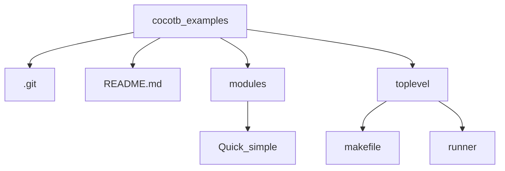

## Cocotb examples using Verilog/VHDL description language

### 0. Requirments:  
- Operating system: Linux / Windows / macOS
- A Verilog or VHDL simulator
- python = 3.13.2
- pip = 24.2
- cocotb = 2.0.0.dev0+63054b88

### 1. Installation of the cocotb
* Install dependencies
` sudo yum install make python3 python3-pip python3-libs `

* Install cocotb
` pip install cocotb `

*  Check the installation
`cocotb-config --version`

### 2. Using Makefile:  
* Compilation using makefile
    - Makefile
    - HDL description file (Verilog/VHDL)
    - Python test bench file

### 3. Using Runner:  
* Compilation using python
    - Python specific file: (as a runner)
    - HDL description file (Verilog/VHDL)
    - Python test bench file

### 4. Verilog Modules:
*  Quick simple

### 5. Folder Structure:

