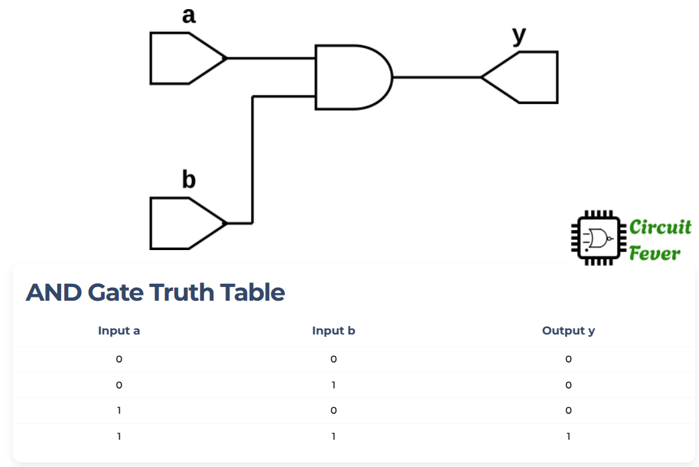

## AND GATE example

AND gate is one of the three basic gates of LOGIC structure of a digital circuits.
AND gate may have many inputs (two, three or many more) and only one output. The output of the AND gate is 1 ***if and only if*** all of the inputs are 1.

The truth table with 2-inputs and one output, is given below:

