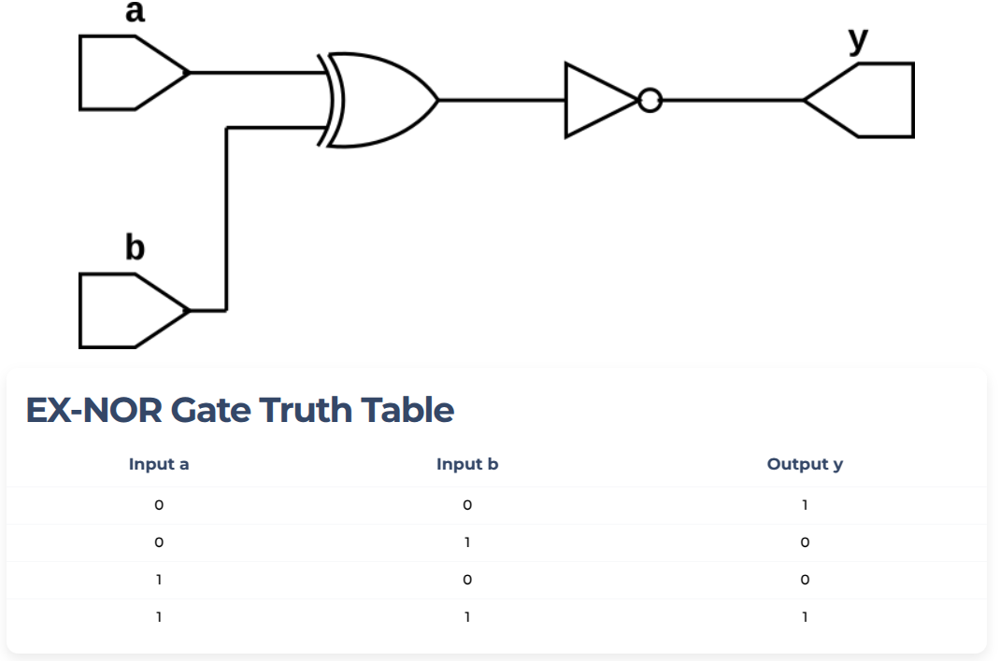

## EX-NOR GATE example

***EX-NOR*** gate is another logic gate used in digital circuits.
EX-NOR gate may have many inputs but only one output.
The output of EX-NOR gate is 1 if even number of inputs are 1 else it is 0 (a high output results if both of the inputs to the gate are the same level).
The truth table of 2-input EX-NOR gate is given below:

