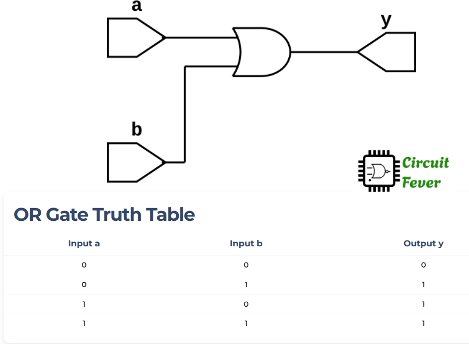

## OR GATE example

***EX-OR*** gate is another logic gate used in digital circuits.
EX-OR gate may have many inputs but only one output.
The output of EX-OR gate is 1 if odd number of inputs are 1 else it is 0 (an output results is high if one, and only one, of the inputs to the gate is true or high). 
The truth table of 2-input EX-OR gate is given below:

