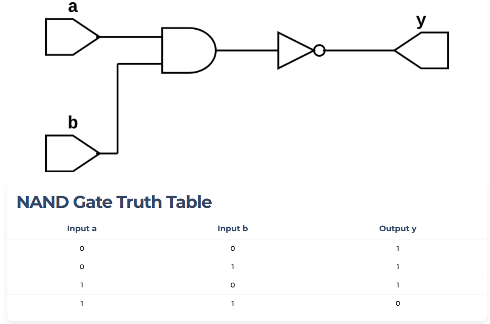

## NAND GATE example

NAND gate can have many inputs (it can be two or more than two inputs) and one output.
Basically, it is AND gate followed by NOT gate. 
The output of the NAND gate is 0 if all inputs are 1 else it is 1.
The truth table of 2-input NAND gate is given below:

