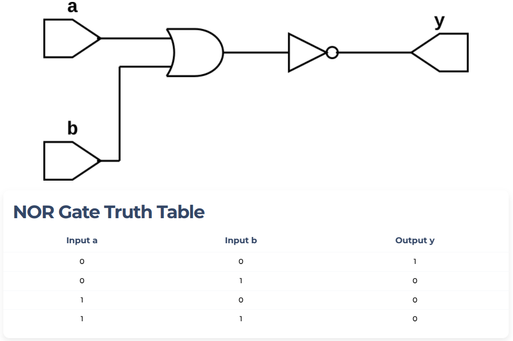

## NOR GATE example

Beside, the three basic logic gates (AND, OR and NOT) there are other two universal gates ***(NAND and NOR)*** and two other logic gates ***Ex-OR and EX-NOR***.
***NOR*** gate has many inputs (it can be two or more than two inputs) and one output. It is ***OR*** gate followed by NOT gate and output of the NOR gate is 1 if all inputs are 0 else it is 0. The truth table of 2-input ***NOR gate*** is given by:

