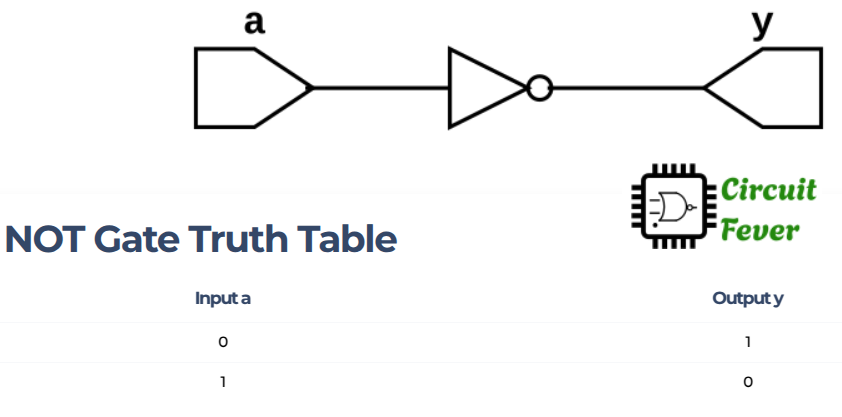

## NOT GATE example

NOT gate is one of the three LOGIC basic gates (AND, OR and NOT) of a digital circuits.
NOT gate has only one input and one output, which behave complementary to each other (if one is 1 the other is 0 and vice versa).

The truth table of NOT gate is given below:

