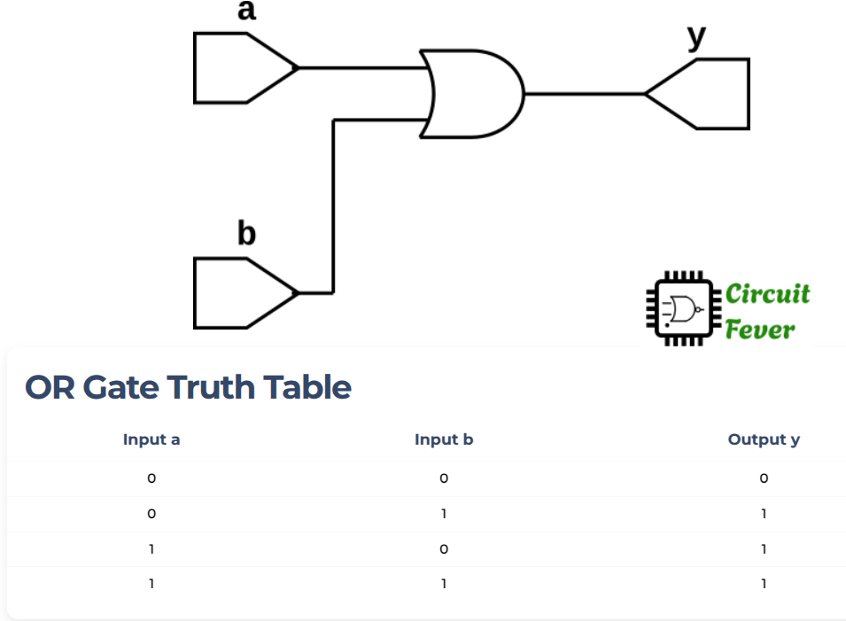

## OR GATE example

OR gate is one of the three LOGIC basic gates of a digital circuits.
OR gate may have many inputs but only one output. The output of the OR gate is 1 ***if at least one inputs is 1***.

The truth table with 2-inputs and one output, is given below:

